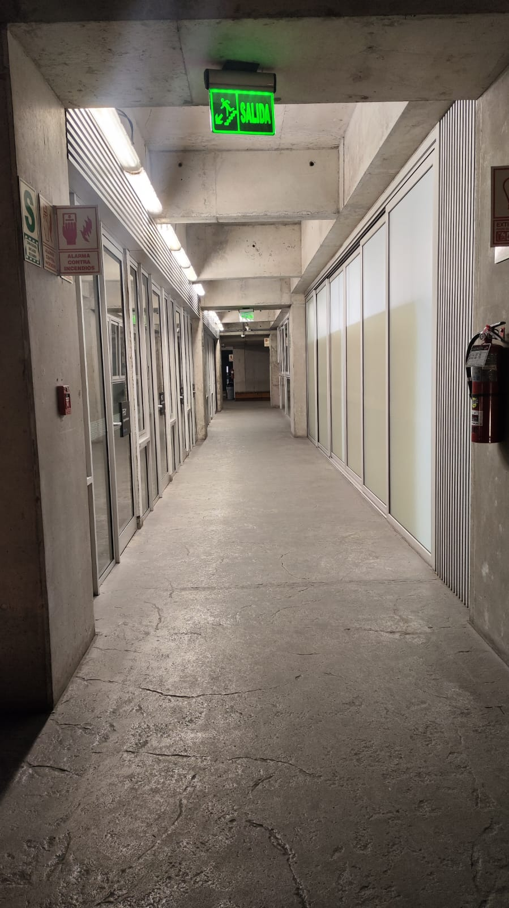
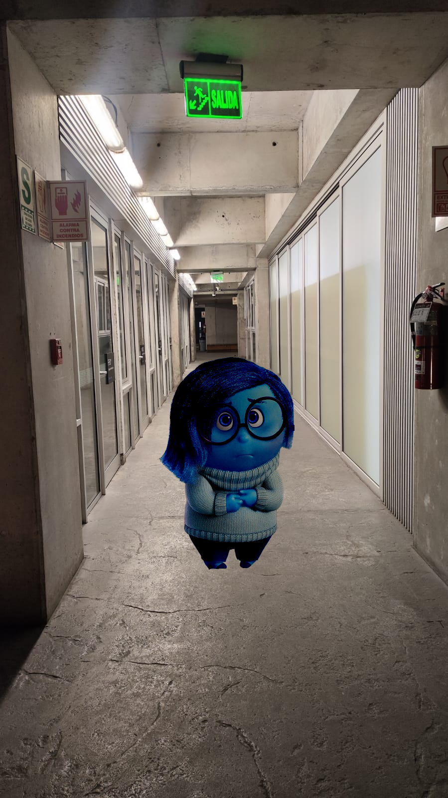
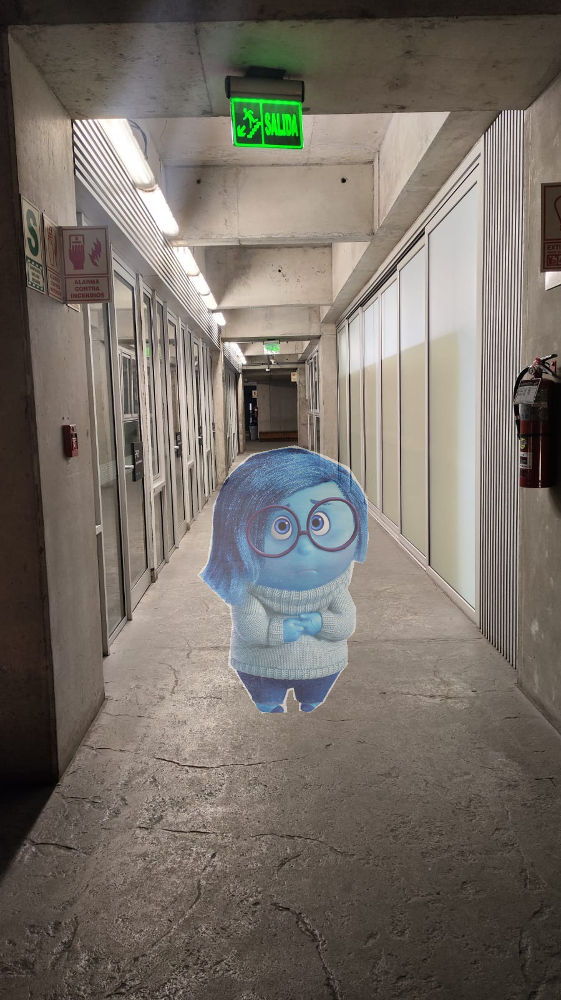

# 🧪 Image Blending - Fusión de Imágenes con Ecuaciones de Poisson & Alfa Blending

   

---

## 👩‍💻 Integrantes

* Libra Vento
* Irán Alvarez
* Julissa Lapa
* Adrián Sandoval

---

## 📌 Introducción

Este proyecto implementa la técnica de *Poisson Image Editing*, una herramienta de edición gráfica basada en la interpolación guiada por gradientes. El objetivo es copiar una región de una imagen (fuente) y fusionarla naturalmente sobre otra (destino), respetando los bordes y texturas locales.

Inspirado en el paper de Pérez, Gangnet y Blake, esta técnica resuelve un sistema de ecuaciones diferenciales para insertar contenido visual de forma suave.

---

## 🎯 Objetivos del Proyecto

* Realizar la fusión natural entre regiones de diferentes imágenes.
* Aplicar el método de interpolación mediante ecuaciones de Poisson.
* Implementar el blending alfa para atenuar una imagen resultado.
* Implementar color transfer para hacer el blending más natural.
* Usar gradientes mixtos para preservar detalles importantes en transiciones visuales.
* Implementar una interfaz interactiva básica para seleccionar imágenes y regiones.

---

## 🚀 Funcionalidades

* 📌 Selección interactiva de máscara poligonal.
* 📷 Selección de punto de inserción sobre la imagen destino.
* 🎨 Fusión por canal (RGB) usando blending normal o con gradientes mixtos.
* 💾 Guardado y visualización del resultado en tiempo real.

---

## 🛠️ Tecnologías y Librerías Usadas

* **Python 3.8+**: Lenguaje de desarrollo principal.
* **NumPy**: Manipulación eficiente de arrays.
* **Matplotlib**: Visualización y selección gráfica.
* **Pillow (PIL)**: Carga y guardado de imágenes.
* **scikit-image**: Para creación de máscaras (función `polygon`).
* **SciPy**: Matrices dispersas y procesamiento numérico.
* **pyamg**: Solver multigrid rápido para el sistema de Poisson.

---

## 📂 Estructura del Proyecto

```
codigo-fuente/
├── blending.py         # Lógica de interpolación por canal
├── color.py            # Lógica de color transfer
├── environment.yml     # Información del entorno virtual
├── main.py             # Ejecución principal del flujo
├── mask.py             # Construcción de la máscara poligonal
├── poisson.py          # Lógica matemática del sistema de ecuaciones
├── README.md           # (Leyendo actualmente)
├── requirements.txt    # Lista de dependencias
├── utilidades.py       # Funciones de carga, selección y guardado
├── EscenasUnity/       # Environment del piso 1 de UTEC
├── output/             # Imágenes output
├── source/             # Imágenes fuente
└── target/             # Imágenes destino
```

---

## 🔧 Instalación

La creación de un entorno virtual es opcional, sin embargo se dejan las instrucciones para hacerlo.

Usando venv:

```bash
# Clona el repositorio
https://github.com/iranalvarez27/IntensamenteEnUTEC.git
cd poisson-blending

# Crea entorno virtual
python -m venv venv
source venv/bin/activate  # o venv\Scripts\activate en Windows

# Instala las dependencias
pip install -r requirements.txt
```

Usando conda:
```bash
# Clona el repositorio
https://github.com/iranalvarez27/IntensamenteEnUTEC.git
cd poisson-blending

# Crear el entorno virtual
conda create environment.yml

# Activar el entorno
conda activate blending-intensamente

# Instalar dependencias
pip install -r requirements.txt

```

Después de la instalación se puede ejecutar el programa usando:

```bash
python main.py
```

---

## 📈 Flujo de Uso

1. Se abre un flujo para elegir si se quieren usar todos los tipos de blending o uno en específico.
1. 1. Se selecciona el blending específico en caso se haya elegido la segunda opción.
2. Se abre un diálogo para elegir imagen fuente.
3. Se dibuja con clics una máscara poligonal.
4. Se elige la imagen destino y se selecciona el punto central donde pegar.
5. Se ejecuta el blending (modo normal, mixed o alfa).
6. Se guarda(n) y muestra(n) la(s) imagen(es) final(es).

---

## 📷 Ejemplo Visual

| Imagen Fuente                     | Imagen Destino                    | Resultado Final  (Poisson Normal)              |
| --------------------------------- | --------------------------------- | ---------------------------------------------- |
|  |  |  |


| Poisson Normal | Poisson Mixed | Alfa Blending |
|--------------------------------------------------|
|  |  |  |

---

## 📚 Referencias

* *Pérez, P., Gangnet, M., & Blake, A.* (2003). [Poisson Image Editing](https://dl.acm.org/doi/10.1145/1201775.882269)
* *Brown University - CS129 Resultados Visuales:* [https://cs.brown.edu/courses/cs129/results/proj2/taox/](https://cs.brown.edu/courses/cs129/results/proj2/taox/)
* *CMU Graphics Lecture 7 (2017):* [https://graphics.cs.cmu.edu/courses/15-463/2017\_fall/lectures/lecture7.pdf](https://graphics.cs.cmu.edu/courses/15-463/2017_fall/lectures/lecture7.pdf)
* *Zuha & Agha (Weebly Project Report):* [https://zuhaagha.weebly.com/uploads/3/1/9/5/31957175/projectreport-poisson-14100196-14100103.pdf](https://zuhaagha.weebly.com/uploads/3/1/9/5/31957175/projectreport-poisson-14100196-14100103.pdf)
* *Documentación de Scikit:* [https://scikit-image.org/](https://scikit-image.org/)
* *Documentación de Pyamg:* [https://github.com/pyamg/pyamg](https://github.com/pyamg/pyamg)
